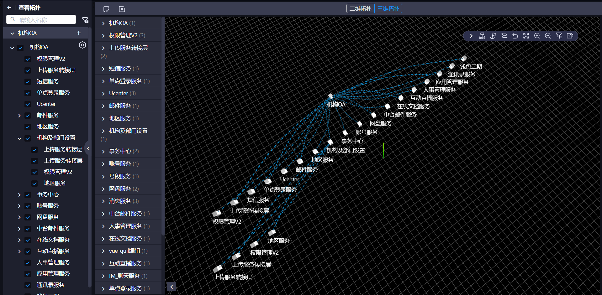

<!--
 * @Author: Billy-S
 * @Description:
 * @Date: 2021-01-18 17:44:21
 * @LastEditTime: 2021-10-09 16:57:03
-->
# @idg/topo-panel
version 1.0 beta

## Install
`yarn add @idg/topo-panel`

## Usage
### 1、服务引用
### appid: cac9ffb424e44a0f924a2536f304cc93
```ts
imrpot {Service} from '@idg/idg'
import ThreeDTopuService from '@idg/topo-panel'


const children =[
  new ThreeDTopuService({
    channelAlias:'default'
  })
]
```

### 2、组件引用
```ts
@Component({
  depends:['component.cac9ffb424e44a0f924a2536f304cc93.three-d-topu.IdgThreeDTopu']
})

export default class XXX extends Vue{
  public render(){
    return <idg-three-d-topu />
  }
}
```

#### beta 版本，尚未定义完全组件属性，后续迭代更新

### 3、数据结构
图node：{
  id，name，channel，
},
图link：{
  id，source，target，channel_link
},
树cNode：{
  id,name,channel,unique_id
},
树cLink：{
  id,source,target,channel_link
},

// 属性
/**
 * Prop:
 * 1、cNodes 通道节点数组 必传
 * 2、cLinks 通道连接数组 必传
 * 3、nodes 实例节点数组 必传
 * 4、links 实例连接数组 必传
 * 5、defaultViewMode 可填值（'tree','pics'):string
 * 6、defaultTopuMode 可填值（2，3）:number
 * 7、fatherSiderContent，父级sider插槽内容，不填渲染默认父级sider结构
 * 8、childSiderContent，子级sider插槽内容，不填渲染默认子级sider结构
 * 9、twoDTreeHoverFields， 二维树视图节点悬浮展示字段数组，注：需要与后端返回字段一致
 * 10、showBackIcon， 是否显示面板返回icon
 */

// 事件
/**
 * on:
 * 1、dragEnd: 拖拽结束事件，param：node(节点数据)
 * 2、channelClick: 二级菜单，通道（子）节点点击事件， param: node, channel
 * 3、childSidePanelRtClick: 二级菜单，panel右击事件，params: node
 * 4、childSideChannelRtClick：二级菜单，channel右击事件， params:channel
 * 5、childSideAddIconClick: 二级菜单，panel add icon 点击事件， params: node
 * 6、submit：topbar提交事件，具体逻辑需根据业务确定，现暂时抛出提交事件
 * 7、treeNodeClick: 树节点点击事件， params: item
 * 8、back: 面板返回点击事件
 */


### 展示



